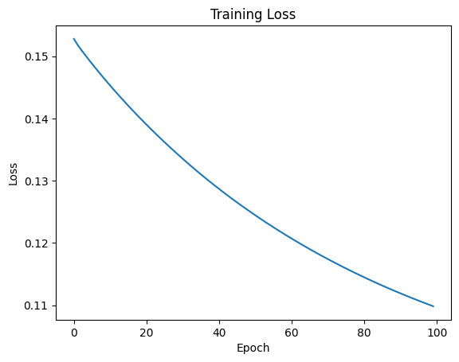
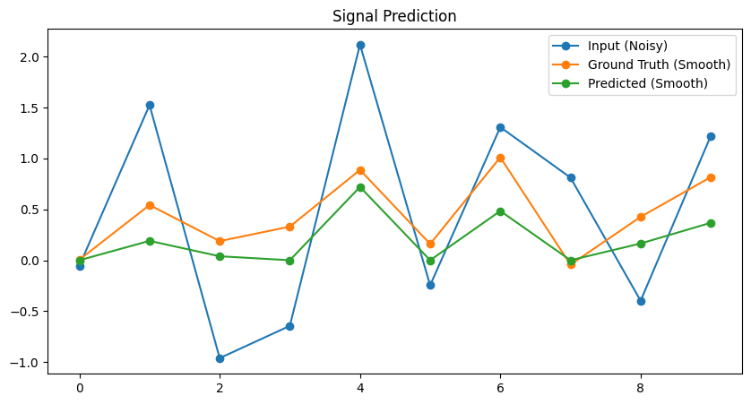

<!-- MathJax Configuration -->

<!-- MathJax Script -->

# My Spectral Convolution Summary

In order to better understand spectral convolution—a concept I struggled with when summarizing the previous GCN paper—I decided to read a new paper[Spectral Networks and Deep Locally Connected
Networks on Graphs](https://arxiv.org/abs/1312.6203) and implement a spectral convolution neural network myself [View my implementation](https://github.com/skato-kx/spectral-convolution-research.github.io). CNNs are known to be highly effective for data that is arranged in a regular grid, such as images and audio. This is largely due to their ability to exploit translational invariance, which allows the same filter with shared weights to slide across the entire input and detect consistent patterns regardless of their position. CNNs also benefit from local filtering and parameter sharing, further improving efficiency.

However, for data that does not possess a regular grid structure—such as social networks or 3D meshes used in physics simulations—CNNs cannot perform convolution based on spatial locality in the same way. An alternative definition of convolution is therefore required.

The paper proposes two new approaches:
- **Spatial construction**: Although the data is in graph form, locality is created by assigning weights to neighboring nodes. In other words, while the nodes are not arranged in a neat grid, the model aggregates features from adjacent nodes, effectively mimicking CNN behavior.
- **Spectral construction**: The more important of the two, this approach applies convolution on graphs by performing a graph Fourier transform to move the signal into the frequency domain, applying frequency-specific filters, and then transforming the result back to the original domain.

The following sections will discuss these two methods in detail.

## Why CNNs and the Two Proposed Methods Are Useful

There are three main reasons why CNNs—and, by extension, the two graph-based methods discussed here—are desirable:
- **Reducing the number of nodes to lower computational cost**: Just as lowering the resolution of an image reduces memory usage, clustering nodes in a graph reduces the number of elements that need to be processed, thereby cutting computation time and memory requirements.
- **Reducing noise in the graph**: Real-world graphs often contain noisy or unnecessary connections and small irregularities. By grouping nodes into larger clusters, these minor variations become relatively insignificant, effectively smoothing out noise.
- **Capturing local structures in a hierarchical manner**: Examining each individual node and its immediate neighbors across the entire graph makes it difficult to understand the overall structure. By progressively looking at larger units—first neighborhoods, then districts, then entire regions—one can more easily identify global patterns. This is similar to finding your house not by checking each building from a satellite image, but by first locating your city, then your state, then your country, and narrowing down step-by-step.

## Spatial Construction Summary

If you are familiar with CNNs, the spatial approach essentially follows the same idea. We begin by representing a graph $G$ as a weighted graph $G = (\Omega, W)$, where:
- $\Omega$ is the set of all nodes.
- $W$ is the weighted adjacency matrix, which records how strongly each pair of nodes is connected—essentially, a matrix of pairwise proximities.

A threshold is applied to the weights in $W$ to determine node neighborhoods, and the entire graph is partitioned into clusters of nodes that are sufficiently close to each other. This clustering process is repeated as the neural network goes deeper: for example, starting with 100 nodes → 50 clusters → 25 clusters → 10 clusters.

In effect, the number of nodes is reduced layer by layer, analogous to reducing the spatial resolution in a CNN through pooling. This hierarchical reduction supports the learning process while preserving locality, making the spatial construction the graph-based counterpart of CNN downsampling.

## Spectral Construction

An alternative approach to performing convolution on graphs using the graph Laplacian.

To put it very simply, this method aims to treat the input graph as a composition of various patterns (i.e., frequency components) that are superimposed on one another. For each pattern, we calculate its contribution (coefficient) to the graph and adjust these coefficients to selectively retain specific patterns. A helpful analogy is audio processing. Imagine recording your voice in a park. The recorded data would include not only your voice but also various noises like wind or other people’s voices, making your voice hard to hear. These are all sounds—vibrations in the air, represented as waves. The recorded audio is a single large wave resulting from the superposition of all these individual waves.

If we could decompose this audio into separate patterns afterward, reducing the contribution of noisy patterns and amplifying your voice, we’d end up with clearer, high-quality audio data. Similarly, the idea here is to decompose the data constituting a graph into patterns and adjust the influence of specific patterns. This way, when performing machine learning later, we can provide the computer with only the desired features. In the context of graphs, patterns might include, for example, “a very smooth pattern where all nodes have similar values” or “a highly irregular pattern where all nodes have different values.” By reducing the influence of the latter, we can transform the data into a smoother version with less noise. Below, I’ll explain the mechanism in a bit more detail.

First, we compute the graph Laplacian.

Given a weighted adjacency matrix $W$ (which captures the strength of connections between all pairs of nodes) and a degree matrix $D$ (which indicates the number of edges connected to each node), the graph Laplacian is defined as:

$$ L = D - W $$

(Alternatively, if using the normalized version, it can be expressed as $L_{\text{sym}} = I - D^{-1/2} W D^{-1/2}$.) This single matrix encapsulates the structure of the graph.

Next, we perform a graph Fourier transform on $L$, which represents the graph’s structure, to decompose it into frequency components (i.e., patterns of variation within the graph).

The foundation of this process is eigendecomposition:

$$ \boxed{L = V \Lambda V^\top} $$

Here, each column of $V$ represents an eigenvector (i.e., a pattern), and $\Lambda$ is a diagonal matrix of corresponding eigenvalues:

$$ \Lambda = \operatorname{diag}(\lambda_0, \lambda_1, \dots, \lambda_{n-1}), \quad 0 = \lambda_0 \le \lambda_1 \le \cdots $$

The eigenvalues $\lambda$ indicate the “roughness” (i.e., frequency) of the corresponding pattern. Smaller $\lambda$ values correspond to “smoother” patterns, while larger $\lambda$ values indicate “jagged” patterns (where adjacent nodes have significantly different values). For example, the “all nodes having similar values” pattern corresponds to the smallest $\lambda$ (a constant vector for a connected graph), while the “all nodes having different values” pattern corresponds to larger $\lambda$ values.

Next, we perform the operation $V^\top x$, where $x$ is the feature vector (node signal) of the original graph data. This operation transforms the features into the frequency domain (i.e., the space of pattern coefficients). It might sound complex, but it’s simply calculating the contributions (coefficients) of each pattern all at once.

To clarify, the original graph’s feature vector $x$ can be expressed as a superposition of eigenvectors (patterns):

$$ x = \sum_i c_i v_i \quad (V = [v_0, \dots, v_{n-1}]) $$

Here, $c = V^\top x$ represents the coefficients (influence) of each pattern. The operation $V^\top x$ is just computing all these $c$ values at once.

Next, we adjust these $c$ coefficients to control their influence. This is where we perform operations like noise reduction or retaining desired features. Mathematically, this is expressed as:

$$ \hat{y} = F (V^\top x) $$

The matrix $F$ contains scaling factors that determine how much each coefficient $c$ is amplified or suppressed (typically, $F$ is a diagonal matrix dependent only on the frequencies, written as $F = g_\theta(\Lambda)$—for example, a low-pass filter would keep small $\lambda$ values and suppress large ones).

After adjusting the coefficients, we transform the result back to the original node space using:

$$ y = V F V^\top x $$

This is the inverse graph Fourier transform, which returns the adjusted $x$. To be precise, to enhance expressiveness, a nonlinear function $h$ (e.g., ReLU or GELU) is applied, resulting in:

$$ x_{\text{new}} = h(V F V^\top x) $$

This new feature vector is passed to the next layer. The nonlinearity $h$ is crucial because stacking linear transformations alone would collapse into a single linear mapping, limiting the model’s power.

### Convolution in the Spectral Domain and Inverse Transform

To create each output channel $j$, we process all input channels $i$ with a diagonal filter dependent on the eigenvalues, sum them, and apply the nonlinearity $h$:

$$ \boxed{ x_{k+1,j} = h\left( \sum_{i=1}^{f_k} \underbrace{V F_{k,i,j} V^\top}_{\text{spectral filter}} x_{k,i} \right), \quad j = 1, \dots, f_{k+1}. } $$

Here:
- $F_{k,i,j} = g_{\theta_{k,i,j}}(\Lambda)$ is a diagonal matrix (a function of $\Lambda$).
- Example: For a low-pass filter, the gain for small $\lambda$ components is high, while large $\lambda$ components are suppressed.
- $V^\top x_{k,i}$ computes the coefficients, $F_{k,i,j}$ scales them, and $V$ transforms them back (i.e., $V F_{k,i,j} V^\top$).
- Contributions from all input channels $i$ are summed to form output channel $j$.
- Finally, $h(\cdot)$ (e.g., ReLU or GELU) adds nonlinearity to enhance expressiveness.

Where:
- $i$: Input channel index at layer $k$ (e.g., features like age or income).
- $j$: Output channel index at layer $k+1$ (new features created by learning).

In summary: **“Each input channel $i$ is adjusted (filtered) by frequency, then combined to create output channel $j$”**—this is precisely spectral convolution.

## Additional Notes on Spectral Convolution

When the spectral convolution formula is applied to grid-like data, such as images, it aligns with the mathematical formulation of standard Convolutional Neural Networks (CNNs). This means that CNNs are a special case of spectral convolution, and the correctness of the spectral convolution framework is supported by this equivalence.

In spectral convolution, the filter $F$ requires one parameter for each coefficient to scale the frequency components, corresponding to the number of nodes $n$ in the graph. This results in a computational complexity of $O(n)$ for the filtering process. However, by using smooth spectral multipliers (interpolated with cubic splines), we can achieve similar behavior by setting only a small subset of parameters, reducing the computational complexity to $O(1)$.

## My Implementation & Results

I implemented a spectral convolution neural network based on the paper.

### Key Features
- **Graph Generation**: Created random undirected weighted graphs (10 nodes each) with sparse adjacency matrices to simulate diverse graph structures.
- **Graph Laplacian and Fourier Transform**: Computed the graph Laplacian \( L = D - W \) and performed eigendecomposition to obtain eigenvectors and eigenvalues for spectral convolution.
- **Spectral Convolution Layer**: Designed a `SpectralConv` layer in PyTorch, with learnable filter parameters applied in the spectral domain, followed by ReLU activation.
- **Network Architecture**: Built a two-layer `SpectralNet` model, processing input signals (1 channel) to hidden (4 channels) and output (1 channel).
- **Dataset**: Generated a synthetic dataset of 100 graphs, where each graph has a noisy input signal (Gaussian noise, \(\sigma=0.5\)) and a smooth ground truth signal constructed from low-frequency components.
- **Training**: Trained the model for 100 epochs using the Adam optimizer (learning rate 0.01) and Mean Squared Error (MSE) loss to predict smooth signals from noisy inputs.

### Results
The model successfully learned to denoise graph signals, as demonstrated by the following:
- **Training Loss**: The MSE loss decreased steadily over 100 epochs, converging to approximately 0.1098, indicating effective learning of the spectral filters.

- **Signal Prediction**: The model accurately predicted smooth signals from noisy inputs. Below is a plot showing the input (noisy), ground truth (smooth), and predicted signals for three test graphs:

- The blue line (Input, Noisy) shows the noisy input signal.
- The orange line (Ground Truth, Smooth) represents the ideal smooth signal.
- The green line (Predicted, Smooth) shows the model's output, closely matching the ground truth in most cases.
